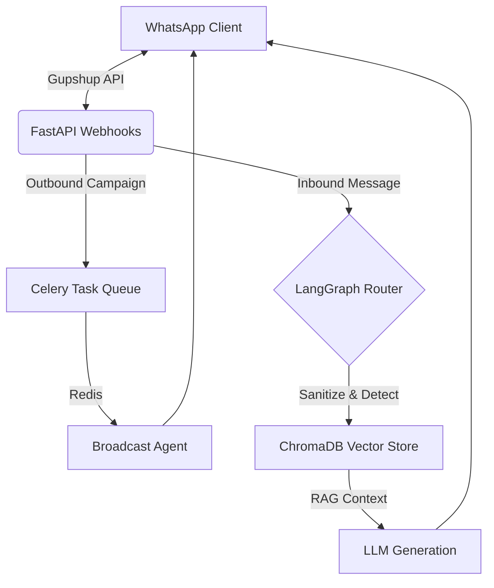

<div align="center">
  
</div>

<p align="center">
  
  
  
  
  
  
</p>

> **A 24/7 dual-bot WhatsApp automation platform for seamless broadcasting and intelligent customer support.**

---

## 🚀 Overview

**TWIN AI** is a robust backend infrastructure designed for businesses that need to automate their client interactions over WhatsApp. Instead of a standard chatbot, TWIN AI utilizes a dual-agent architecture powered by **LangGraph** and **FastAPI** to manage both outbound marketing and inbound intelligent support.

### 🤖 The Two Bots

1.  **Broadcast Agent (Bot 1):** An asynchronous bulk-messaging agent built on **Celery and Redis**. It personalizes and queues marketing messages, enforcing delivery windows and rate limits (up to 80 messages/sec) via the Gupshup API, while tracking real-time delivery receipts.
2.  **Client Assistant (Bot 2):** An intelligent **RAG (Retrieval-Augmented Generation)** bot built using **LangGraph** and **ChromaDB**. It handles 24/7 inbound queries, automatically detects languages, sanitizes inputs, retrieves context from a self-hosted vector database, and generates highly accurate, hallucination-free responses using OpenAI embeddings.

---

## ⚙️ Architecture & Data Flow

This project utilizes a highly decoupled microservices architecture designed to scale. 



## 🛠️ Tech Stack

*   **Core Backend:** FastAPI (Python 3.11)
*   **AI & Orchestration:** LangGraph, OpenAI (`text-embedding-3-small`), ChromaDB
*   **Task Queue:** Celery, Redis
*   **Database:** PostgreSQL 15, SQLAlchemy, Alembic
*   **Integration:** Gupshup WhatsApp API
*   **Deployment:** Docker, Docker Compose

---

## 📡 Core Features

*   **Intelligent Routing & Guardrails:** LangGraph nodes for input sanitization, rate limiting, language detection, and out-of-scope query deflection.
*   **Strict RAG Pipeline:** Generates retrieval-only responses to guarantee zero hallucinations. Low confidence (< 0.75) queries are automatically flagged for human review.
*   **Campaign Delivery Tracking:** Complete lifecycle tracking for broadcast recipients (Sent → Delivered → Read → Failed).
*   **Opt-in Enforcement:** Strict compliance with WhatsApp policies; automatically halts messages to users who opt out (`STOP`).

---

## 🚀 Getting Started

### Prerequisites
*   Docker & Docker Compose
*   OpenAI API Key
*   Gupshup API Credentials

### Quickstart

1.  **Clone the repository:**
    ```bash
    git clone https://github.com/rakesh2971/Twin_AI.git
    cd Twin_AI
    ```

2.  **Configure Environment:**
    Copy `.env.example` to `.env` and fill in your API keys.
    ```bash
    cp .env.example .env
    ```

3.  **Spin up the infrastructure:**
    ```bash
    docker-compose up --build -d
    ```

4.  **Run Database Migrations:**
    ```bash
    docker-compose exec api alembic upgrade head
    ```

The FastAPI backend will now be running on `http://localhost:8000`. You can access the automatic interactive API documentation at `http://localhost:8000/docs`.

---

## 📄 License

This project is open-source and available under the [MIT License](LICENSE).

<div align="center">
  <i>Built with 🧡 by Rakesh Telang</i>
</div>
